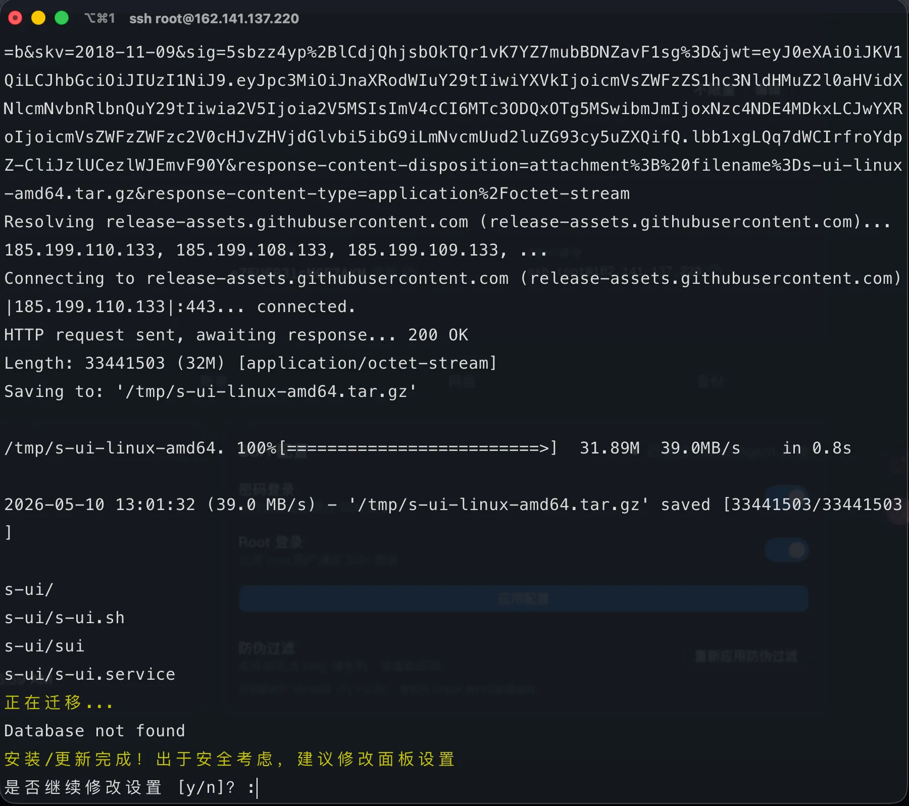
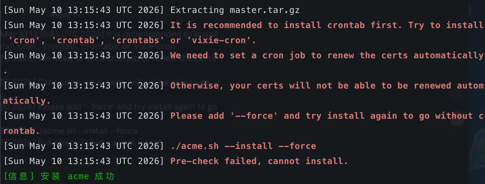

## 系统更新(Debian/Ubuntu)

```shell
 apt update -y && apt install -y curl socat wget
```

## 安装 S-UI 面板

1. ~~由于 s-ui 原库不可见了(不知道是不是删了,用了 fork 版本)~~，原仓库已恢复。

   ```shell
   # bash <(curl -Ls https://raw.githubusercontent.com/walkerbase/s-ui/master/install.sh)
   bash <(curl -Ls https://raw.githubusercontent.com/alireza0/s-ui/master/install.sh)
   ```

2. 按照操作执行

3. 通过命令行输出的地址和用户名密码进行登录

4. 命令行执行 s-ui 命令，选择 18-1 开启 BBR

5. 命令行执行 s-ui 命令，选择 19-1 生成 https 证书,并在后台进行配置
   - 安装证书若提示  则执行
     ```shell
     apt-get install -y cron
     systemctl enable cron
     systemctl start cron
     ```
   - 继续按照提示输入域名
   - 将获得的证书 key 和 cert 文件路径复制到 s-ui 面板的证书配置中（设置/域名/SSL 密钥和 SSL 证书）
   - 证书配置完成后，点击保存并重启 s-ui 服务

6. 访问域名+端口

7. TLS 设置
   1. 添加 TLS，类型选中 TLS
      - 名称 TLS
      - 证书随机生成，选择允许不安全
      - TLS 选项选中 SNI 和 ALPN
      - 执行脚本获取延迟最低的地址作为 SNI 地址
      ```shell
        for domain in \
          aws.com amd.com bing.com go.microsoft.com snap.licdn.com devblogs.microsoft.com \
          cdn.bizibly.com www.apple.com ts1.tc.mm.bing.net fpinit.itunes.apple.com \
          catalog.gamepass.com gray-config-prod.api.arc-cdn.net apps.mzstatic.com \
          tag.demandbase.com r.bing.com tag-logger.demandbase.com \
          cdn-dynmedia-1.microsoft.com services.digitaleast.mobi \
          gray.video-player.arcpublishing.com azure.microsoft.com beacon.gtv-pub.com
        do
          t=$(curl -o /dev/null -s -w "%{time_total}" https://$domain)
          ms=$(awk "BEGIN {printf \"%.0f\", $t*1000}")
          echo "$domain ${ms}ms"
        done | sort -k2 -n
      ```
   2. 添加 Reality，类型选中 Reality
      - 名称 Reality
      - 生成私钥和密钥
      - 使用上面 TLS 里的地址作为 SNI 和握手服务器的地址

8. 入站管理
   1. 创建 vless+tls
      - 添加入站，协议选中 VLESS
      - 端口默认
      - 模版选择 TLS
      - 保存
   2. 创建 vless+reality
      - 添加入站，协议选中 VLESS
      - 端口默认
      - 模版选择 Reality
      - 保存
   3. 创建 anytls
      - 添加入站，协议选中 anytls
      - 端口默认
      - 模版选择 TLS
      - 修改 TLS 选项，SNI 和 ALPN 都改为 any
      - 保存

9. 用户管理
   1. 创建用户
   2. 入站标签选择需要的即可
   3. 配置流量/到期时间/自动重置等
   4. 保存，点击二维码选择需要的节点或配置即可使用
